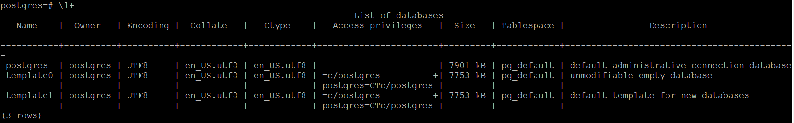

# Домашнее задание к занятию "6.4. PostgreSQL"

## Задача 1

Используя docker поднимите инстанс PostgreSQL (версию 13). Данные БД сохраните в volume.
```
docker volume create vol_postgres
docker run --rm --name nt-postgres -e POSTGRES_PASSWORD=postgres -ti -p 5432:5432 -v vol_postgres:/var/lib/postgresql/data -d postgres:13
docker exec -it nt-postgres bash
```
Подключитесь к БД PostgreSQL используя `psql`.
```
root@serverd:/home/pp/net64# docker exec -it nt-postgres bash
root@18c5fec349d5:/# psql -h localhost -p 5432 -U postgres -W
Password:
psql (13.7 (Debian 13.7-1.pgdg110+1))
Type "help" for help.

```
Воспользуйтесь командой `\?` для вывода подсказки по имеющимся в `psql` управляющим командам.
```
postgres=# \?
General
  \copyright             show PostgreSQL usage and distribution terms
...
```
**Найдите и приведите** управляющие команды для:
- вывода списка БД
>\l+

- подключения к БД
> \c[onnect] {[DBNAME|- USER|- HOST|- PORT|-] | conninfo}  
\c postgres
- вывода списка таблиц
```
postgres=# \dt
Did not find any relations.
postgres=# \dtS
                    List of relations
   Schema   |          Name           | Type  |  Owner
------------+-------------------------+-------+----------
 pg_catalog | pg_aggregate            | table | postgres
 pg_catalog | pg_am                   | table | postgres
 pg_catalog | pg_amop                 | table | postgres
 pg_catalog | pg_amproc               | table | postgres
 pg_catalog | pg_attrdef              | table | postgres
 pg_catalog | pg_attribute            | table | postgres
 pg_catalog | pg_auth_members         | table | postgres
 pg_catalog | pg_authid               | table | postgres
 ...
```
- вывода описания содержимого таблиц
```
postgres=# \dS+
                                            List of relations
   Schema   |              Name               | Type  |  Owner   | Persistence |    Size    | Description
------------+---------------------------------+-------+----------+-------------+------------+-------------
 pg_catalog | pg_aggregate                    | table | postgres | permanent   | 56 kB      |
 pg_catalog | pg_am                           | table | postgres | permanent   | 40 kB      |
 pg_catalog | pg_amop                         | table | postgres | permanent   | 80 kB      |
 pg_catalog | pg_amproc                       | table | postgres | permanent   | 64 kB      |
 pg_catalog | pg_attrdef                      | table | postgres | permanent   | 8192 bytes |
 pg_catalog | pg_attribute                    | table | postgres | permanent   | 456 kB     |
 pg_catalog | pg_auth_members                 | table | postgres | permanent   | 40 kB      |
 pg_catalog | pg_authid                       | table | postgres | permanent   | 48 kB      |
 pg_catalog | pg_available_extension_versions | view  | postgres | permanent   | 0 bytes    |
 ...
```
- выхода из psql
>postgres=# \q  
root@18c5fec349d5:/#


## Задача 2

Используя `psql` создайте БД `test_database`.
```
postgres=# CREATE DATABASE test_database;
CREATE DATABASE
```
Изучите [бэкап БД](https://github.com/netology-code/virt-homeworks/tree/master/06-db-04-postgresql/test_data).

Восстановите бэкап БД в `test_database`.
```
root@serverd:/home/pp/net64# docker cp ./test_dump.sql nt-postgres:/tmp
root@serverd:/home/pp/net64# docker exec -it nt-postgres bash
root@18c5fec349d5:/#  psql -U postgres -f /tmp/test_dump.sql test_database
SET
SET
SET
SET
SET
 set_config
------------

(1 row)

SET
SET
SET
SET
SET
SET
CREATE TABLE
ALTER TABLE
CREATE SEQUENCE
ALTER TABLE
ALTER SEQUENCE
ALTER TABLE
COPY 8
 setval
--------
      8
(1 row)

ALTER TABLE
```

Перейдите в управляющую консоль `psql` внутри контейнера.
>root@18c5fec349d5:/# psql -U postgres  
psql (13.7 (Debian 13.7-1.pgdg110+1))  
Type "help" for help.

Подключитесь к восстановленной БД и проведите операцию ANALYZE для сбора статистики по таблице.

```
postgres=# \c test_database
You are now connected to database "test_database" as user "postgres".

 ANALYZE VERBOSE public.orders;
 test_database=#  ANALYZE VERBOSE public.orders;
INFO:  analyzing "public.orders"
INFO:  "orders": scanned 1 of 1 pages, containing 8 live rows and 0 dead rows; 8 rows in sample, 8 estimated total rows
ANALYZE

```

Используя таблицу [pg_stats](https://postgrespro.ru/docs/postgresql/12/view-pg-stats), найдите столбец таблицы `orders` 
с наибольшим средним значением размера элементов в байтах.
```
test_database=# select avg_width from pg_stats where tablename='orders';
 avg_width
-----------
         4
        16
         4
(3 rows)

```

**Приведите в ответе** команду, которую вы использовали для вычисления и полученный результат.

## Задача 3

Архитектор и администратор БД выяснили, что ваша таблица orders разрослась до невиданных размеров и
поиск по ней занимает долгое время. Вам, как успешному выпускнику курсов DevOps в нетологии предложили
провести разбиение таблицы на 2 (шардировать на orders_1 - price>499 и orders_2 - price<=499).


Предложите SQL-транзакцию для проведения данной операции.
```sql
BEGIN;
CREATE TABLE orders_more_499_price (CHECK (price > 499)) INHERITS (orders);
INSERT INTO orders_more_499_price SELECT * FROM orders WHERE price > 499;
CREATE TABLE orders_less_499_price (CHECK (price <= 499)) INHERITS (orders);
INSERT INTO orders_LESS_499_price SELECT * FROM orders WHERE price <= 499;
DELETE FROM ONLY orders;
COMMIT;
```
Можно ли было изначально исключить "ручное" разбиение при проектировании таблицы orders?

Да, прописав правила вставки, например:

>CREATE RULE orders_insert_to_more AS ON INSERT TO orders WHERE ( price > 499 ) DO INSTEAD INSERT INTO orders_more_499_price VALUES (NEW.*);  
>CREATE RULE orders_insert_to_less AS ON INSERT TO orders WHERE ( price <= 499 ) DO INSTEAD INSERT INTO orders_less_499_price VALUES (NEW.*);  


## Задача 4

Используя утилиту `pg_dump` создайте бекап БД `test_database`.
>export PGPASSWORD=netology && pg_dump -h localhost -U postgres test_database > /tmp/test_database_backup.sql  
> 
Как бы вы доработали бэкап-файл, чтобы добавить уникальность значения столбца `title` для таблиц `test_database`?
```
ALTER TABLE  public.orders
ALTER COLUMN  title
SET NOT NULL;
```
